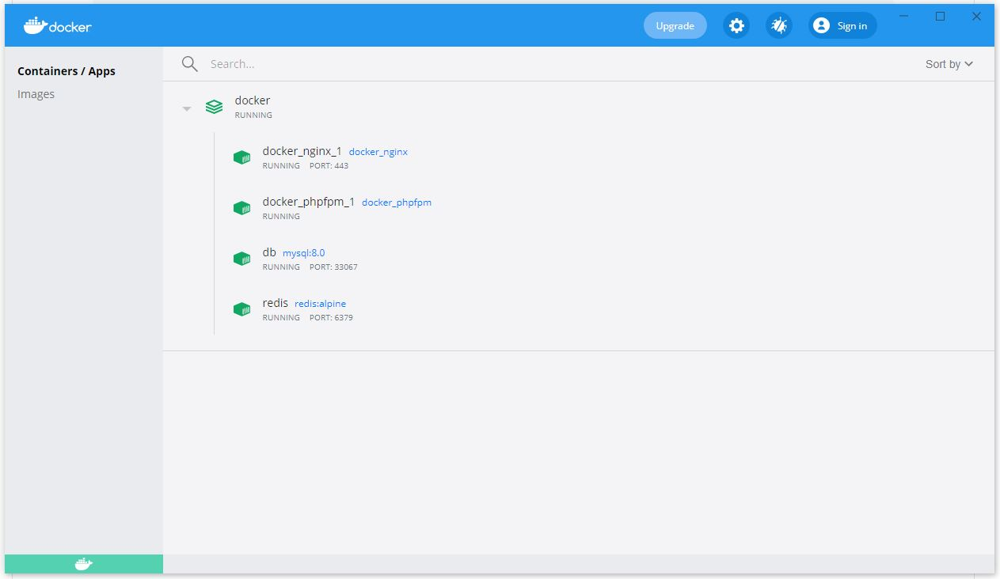
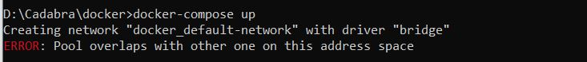

Docker setup
===============

The Docker environment project.

## Directory structure
```
├─ docker-compose.yml
│
├─ mysql
│   └─ my.cnf
├─ nginx
|   ├─ conf.d
|   ├─ ...
│   └─ Dockerfile
│
├─ php
|   ├─ config
|   ├─ ...
│   └─ Dockerfile
│
├─ .env
│
```

## Setup manual
**1. Install Docker Desktop on Windows**:

- Download Docker Desktop for Windows. </br>
  https://hub.docker.com/editions/community/docker-ce-desktop-windows/

(*) Requires Microsoft Windows 10 Professional or Enterprise 64-bit, or Windows 10 Home 64-bit with WSL 2.

**2. Modify project path**

Copy and rename the '.env.example' file to '.env'.

Modify the source directory in .env file.
```
SOURCE_PATH=<SOURCE DIRECTORY>
VOLUME_PATH=/var/www/html1
```

- Application will be mounted to `/var/www/html1`
 
You may modify project paths <SOURCE DIRECTORY> in above directory with your local paths.

Eg:
```
SOURCE_PATH=C:\workspace\laravel-react-project
```

- Modify others configurations if needed.</br>
eg: you can modify the port number of http/https instead of the default configuration shown below.
```
APP_PORT=80
APP_SSL_PORT=443
```

**3. Check configuration of Nginx server**

Directory docker\nginx\conf.d\default.conf
```
server {
    ...
    root  /var/www/html1/public;
    ....
    location ~ \.php {
      fastcgi_pass            docker_phpfpm_1:9000;
    ...
    }
}
```
Explain
- root : the VOLUME_PATH, the project mounted directory
- docker_phpfpm_1 : phpfpm containner, the generated default name

**4. Build docker**

By using window command line ..etc<br />

1/ Go to docker's directory.<br />
2/ Build image by command.<br />
```bash
docker-compose build
```

3/ Build containner.																				
```bash
docker-compose up
```

if it's all successed, all the services are running as image below


**5. Access local site**

http://localhost/

* if the default port 80/443 has modified in .env file, it's must be specified in the url properly.

## Useful commands inside container

Get inside a containner
eg:
```bash
    docker exec -it docker_nginx_1 bash
    docker exec -it docker_phpfpm_1 bash
```

To update composer packages
```bash
composer install
```

Show docker images (run on host machine)
```bash
docker ps
```									

Inspect a container (run on host machine)	</br>
eg : check container service redis</br>
```bash
docker inspect redis
```

Check docker network (run on host machine)
```bash
docker network ls
```

Remove specific docker network (run on host machine)
```bash
docker network rm NETWORK [NETWORK...]
```

- (Optional) Cleanup build folder (run on host machine):
```bash
docker system prune
```

- (Optional) Show all images (run on host machine):
```bash
docker images
```

- (Optional) Clean all images and containers (run on host machine):
```bash
docker rm $(docker ps -a -q)
docker rmi $(docker images -q)
```

## Common errors and how to solve
1. ERROR: Pool overlaps with other one on this address space


the docker subnet mark is already in use </br>
So, remove the confict network or changing the config in .env file and build again!

Remove the confict network by following commands
```bash
docker network ls
docker network rm NETWORK_NAME
```

changing the ip config in .env file.
```bash
DOCKER_SUBNET=172.20.0.0/16
NGINX_IPV4_ADDRESS=172.20.0.2
PHPFPM_IPV4_ADDRESS=172.20.0.3
REDIS_IPV4_ADDRESS=172.20.0.4
MYSQL_IPV4_ADDRESS=172.20.0.5 
```
